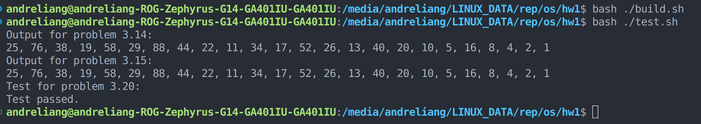

# Operating System, Spring 2023 HW1
B11705009 An-Che, Liang

## Execution result:

This is the execution result of three problems:


And these are the bash script I use to build and test my program:
```bash
gcc ./3_14.c -o 3_14
gcc ./3_15.c -o 3_15
gcc ./3_20.c -o filecopy
```

```bash
echo "Output for problem 3.14:"
./3_14 25
echo "Output for problem 3.15:"
./3_15 25
echo "Test for problem 3.20:"

old_file="./bible.txt"
new_file="./new_bible.txt"
./filecopy "$old_file" "$new_file"

if cmp -s "$old_file" "$new_file";
then
    echo "Test passed."
else
    echo "Test failed."
fi
```

## Problem 3.14:

First, I check the arguments stored in `char **argv` and exit the program if n ≤ 0.

Then I use `pid_t pid = fork()` to fork another process, afterward check the value of `pid` to determine whether the program is running on parent process or child process. 

If it is on child process, then compute the Collatz conjecture sequence, store the sequece into `int seq[SEQUENCE_LIMIT]`, then print the sequence using `printf()`.

If it is on the parent process, wait for the child process to complete with `wait(NULL)`.

## Problem 3.15:

In this problem, I create a shared memory object to achive interprocess communication.

First I use `pid_t pid = fork()` to fork another process, then check the value of `pid` to determine whether the program is running on parent process or child process.

On the child process, first use `shm_open()` to create a shared memory object, then use `ftruncate()` to configure its memory size, finally use `mmap()` to map the memory-mapped file into memory.
```c
int segment_fd = shm_open(shared_object_name, O_CREAT | O_RDWR, 0666);
ftruncate(segment_fd, sizeof(int) * SEQUENCE_LIMIT);
int *ptr = mmap(0, sizeof(int) * SEQUENCE_LIMIT, PROT_WRITE, MAP_SHARED, segment_fd, 0);
```
Then compute the Collatz conjecture sequence, store the result (treat `int *ptr` as a 1-dimensional array), then use `shm_unlink` to remove the shared-memory segment.

## Problem 3.20:

First parse the arguments to get where to copy the file and the destination, then I use `fopen()` to open files and `pipe(fd)` to create a UNIX ordinary pipe, afterward use `pid_t pid = fork()` to fork another process.

On the parent process first close the unused pipe `WRITE_END`, read the input file with `fopen`, and write the content in the buffer into pipe with `write()`, also perform some error detection.
```c
close(fd[WRITE_END]);
while ((bytes_read = fread(buffer, sizeof(char), BUFFER_SIZE, input_stream)) > 0)
    {
        bytes_written = write(fd[WRITE_END], buffer, bytes_read);
        if (bytes_written != bytes_read)
        {
            fprintf(stderr, "Read from input error\n");
            return 1;
        }
    }
```
Remember to close both pipe `WRITE_END` and input file stream after I have read all the contents from the input file, then wait for the child process to finish writing by `wait(NULL)`;
```c
close(fd[WRITE_END]);
fclose(input_stream);
wait(NULL);
```
On the child process, just like on the parent process, I close the unused pipe `READ_END`, read the pipe with `open`, and write the content from the buffer into destination file with `fwrite()`, then finally close both pipe `READ_END` and destination file stream.

