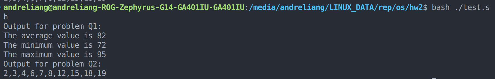

# Operating System, Spring 2023 HW2

B11705009 An-Che, Liang

## Execution result:

This is the execution result of three problems:


And these are the bash script I use to build and test my program:

```bash
gcc ./Q1.c -o Q1
gcc ./Q2.c -o Q2
```

```bash
echo "Output for problem Q1:"
./Q1 90 81 78 95 79 72 85
echo "Output for problem Q2:"
./Q2 7 12 19 3 18 4 2 6 15 8
```

## Problem Q1:

First, I use `atoi()` to convert the strings in `char **argv` into integers, then store those values into a static array with the size of `SEQUENCE_LIMIT=1000`.

Then, I define three pthread functions: `void *average_runner(void*)`, `void *max_runner(void *)` and `void *min_runner(void *)`, which will read the sequence data and compute the _average_, _maximum_ and _minimum_ values. Since both the sequence data and the completed values are stored in the global scope, we don't have to pass parameter pointers to our threads.

Afterward, use `pthread_create()` to create three different worker threads, so that the calculations can be done concurrently. Finally, use `pthread_join()` to wait for each threads to finish their task, then print out the desired values.

## Problem Q2:

First, just like in **Problem 1**. I use `atoi()` to convert the strings in `char **argv` into integers, then store those values into a static array with the size of `SEQUENCE_LIMIT=1000`.

Then, I define the sorting pthread function, its parameter data structure, and the comparision function for the built-in `qsort()` algorithm.

```c
struct sort_param
{
    int start_pos;
    int size;
};

int cmp(const void *a, const void *b)
{
    return (*(int *)a - *(int *)b);
}

void *sorting_runner(void *param_ptr)
{
    struct sort_param *param = param_ptr;
    qsort(&sequence[param->start_pos], param->size, sizeof(int), cmp);
    pthread_exit(0);
}
```

Then, start two sorting worker threads, so that one can sort the first half of the sequence, and the other can sort the second half of the sequence. Those two operations are done concurrently. Then wait for all the threads, so we can merge two subsequence together.

```c
pthread_t seq1_tid, seq2_tid, merge_tid;
pthread_attr_t attr;
pthread_attr_init(&attr);
pthread_create(&seq1_tid, &attr, sorting_runner, &param_1);
pthread_create(&seq2_tid, &attr, sorting_runner, &param_2);

pthread_join(seq1_tid, NULL);
pthread_join(seq2_tid, NULL);
```

To merge two subsequence together, I define the following pthread function:

```c
void *merge_runner(void *unused)
{
    int tmp[SEQUENCE_LIMIT];
    for (int i = 0; i < sequence_length; i++)
    {
        tmp[i] = sequence[i];
    }
    int front_count = sequence_length / 2, back_count = (sequence_length - sequence_length / 2);
    int front_pos = 0, back_pos = sequence_length / 2;
    for (int i = 0; i < sequence_length; i++)
    {
        if (front_count == 0 || (back_count > 0 && tmp[back_pos] < tmp[front_pos]))
        {
            sequence[i] = tmp[back_pos];
            back_pos += 1;
            back_count -= 1;
        }
        else
        {
            sequence[i] = tmp[front_pos];
            front_pos += 1;
            front_count -= 1;
        }
    }
    pthread_exit(0);
}
```

Note that I use a local array `int tmp[SEQUENCE_LIMIT]` to store the status of the sequence before merge. Then for every iterations, choose the smallest remaining element of the two subsequence to add to the merged sequence.

Finally, print out the merged sequence.
